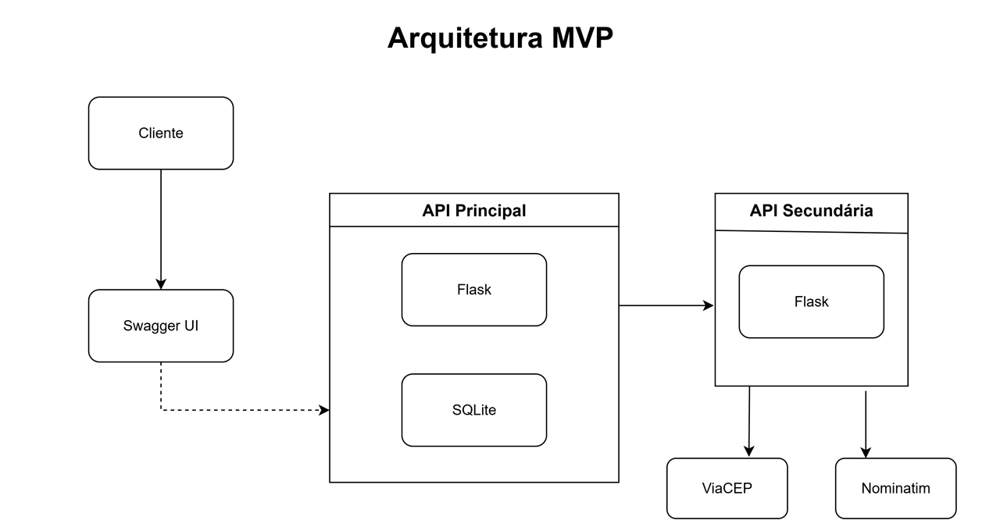

# MVP 2 — Distância entre CEPs (Flask + Docker)

Este projeto implementa um MVP composto por **duas APIs Flask**:

- **API Secundária**: calcula a distância (linha reta — Haversine) entre duas coordenadas (`lat`, `lon`).
- **API Principal**: recebe dois **CEPs**, consulta **ViaCEP**, geocodifica com **Nominatim (OpenStreetMap)** para obter coordenadas e delega o cálculo de distância para a **API Secundária**. Também **persiste** os resultados em **SQLite** e expõe rotas **CRUD**.

Ambas as APIs possuem **Swagger UI** via **Flasgger**.

## Arquitetura do Projeto

A arquitetura é composta por duas APIs em Flask:  
- **API Principal:** expõe as rotas, faz a integração com os serviços externos e persiste os dados no SQLite.  
- **API Secundária:** realiza o cálculo de distância usando a fórmula de Haversine.  

Diagrama ilustrativo:


---

##  Requisitos Atendidos

- Linguagem **Python (Flask)**.
- **Mínimo de 4 rotas** (GET, POST, PUT, DELETE).
- **Integração com API externa gratuita** (ViaCEP + Nominatim).
- **Banco de dados** (SQLite) com persistência.
- **Dockerfile** por serviço e **docker-compose** para orquestração.
- **Swagger UI** para documentação e testes.

---

##  Estrutura de Pastas

```
mvp-2/
├── api_principal/
│   ├── app.py
│   ├── Dockerfile
│   └── requirements.txt
├── api_secundaria/
│   ├── app.py
│   ├── Dockerfile
│   └── requirements.txt
├── docker-compose.yml
└── README.md
```

---

##  Como Executar (Docker Compose)

Pré-requisitos:
- Windows 10/11 com **WSL2** e **Docker Desktop** em execução

Passos:

```powershell
cd C:\mvp-2
docker compose up -d --build
```

Verifique se os containers estão ativos:

```powershell
docker ps --format "table {{.Names}}	{{.Ports}}	{{.Status}}"
```

Parar tudo:

```powershell
docker compose down
```

---

##  Testes no Swagger

1. **POST /distancia-por-cep**
   ```json
   {
     "origem": "01001-000",
     "destino": "20040-020",
     "observacoes": "Teste via docker compose"
   }
   ```

2. **GET /consultas** – listar registros
3. **GET /consultas/{id}** – detalhar
4. **PUT /consultas/{id}** – atualizar observações
5. **DELETE /consultas/{id}** – excluir

---

##  Banco de Dados

- **SQLite** persistente via volume Docker.
- Caminho: `/data/mvp2.db` (configurado em `docker-compose.yml`).

Tabela `consultas`:
- id, cep_origem, cep_destino, lat1, lon1, lat2, lon2, distancia_km, criado_em, observacoes.

---

##  Modo Desenvolvimento (sem Docker)

```powershell
# API Secundária
cd C:\mvp-2\api_secundaria
python app.py

# API Principal
cd C:\mvp-2\api_principal
python app.py
```

Swagger:
- Principal → http://127.0.0.1:5000/apidocs
- Secundária → http://127.0.0.1:5001/apidocs
